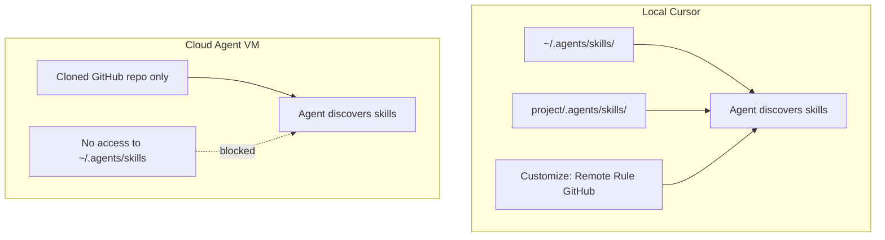
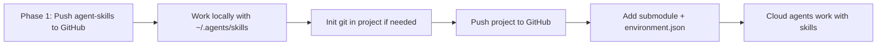

# Skills GitHub Backup and Cloud Agent Access

## Current state


| Item                  | Status                                                                                                                                            |
| --------------------- | ------------------------------------------------------------------------------------------------------------------------------------------------- |
| Skills location       | `[/Users/n2g7/.agents/skills](/Users/n2g7/.agents/skills)` — 1,433 `SKILL.md` files, ~67MB                                                        |
| Git                   | **Not initialized** (no `.git` in skills folder)                                                                                                  |
| Existing backup       | `[/Users/n2g7/.agents/skills.backup-20260605-013949.tar.gz](/Users/n2g7/.agents/skills.backup-20260605-013949.tar.gz)` (keep as local safety net) |
| Catalog + recommender | `[_catalog/](/Users/n2g7/.agents/skills/_catalog/)` and `[skill-recommender/](/Users/n2g7/.agents/skills/skill-recommender/)` already built       |


## How Cursor loads skills (local vs cloud)




**Key constraint from [Cursor Cloud Agents docs](https://cursor.com/docs/cloud-agent):** Cloud VMs clone your GitHub repo and run in isolation. They do **not** have your Mac home directory, `~/.agents/skills/`, or `~/.cursor/hooks.json`. Skills must exist **inside the cloned repo** (or be pulled in via submodule).

**Skill discovery paths** (from [Cursor Skills docs](https://cursor.com/docs/skills)):

- Project: `.agents/skills/` or `.cursor/skills/` (recursive — subfolders OK)
- Global (local only): `~/.agents/skills/` or `~/.cursor/skills/`

Your chosen strategy (**both**) maps cleanly to:

1. **Standalone private repo** — backup, sync across machines, run cloud agents directly on the skills repo for recommendations
2. **Git submodule** — embed skills into code project repos so cloud agents on those projects get the full library

---

## Phase 1: Create the private GitHub skills repo

### 1. Initialize git in the skills folder

Work in `[/Users/n2g7/.agents/skills](/Users/n2g7/.agents/skills)`:

```bash
cd ~/.agents/skills
git init
```

### 2. Add a root `.gitignore`

Exclude noise and secrets that may exist inside skill folders:

```
# OS / editor
.DS_Store
*.swp
.idea/
.vscode/

# Python / Node artifacts inside skills
__pycache__/
*.pyc
node_modules/
.venv/
venv/

# Secrets — never commit
.env
.env.*
*.pem
credentials.json
**/secrets/

# Large generated caches (if any appear later)
*.tar.gz
```

Commit `_catalog/` and `skill-recommender/` — they are essential for cloud skill recommendations.

### 3. Add a repo `README.md`

Short README covering:

- What the repo is (personal agent skills library)
- Local install: `git clone <repo> ~/.agents/skills`
- Cloud usage: submodule instructions (Phase 3)
- Regenerate catalog: `python3 _catalog/regenerate.py`
- Invoke recommender: `/skill-recommender` or attach `@skill-recommender`

### 4. Create private GitHub repo and push

```bash
gh repo create agent-skills --private --source=. --remote=origin
git add .
git commit -m "Initial commit: 1,400+ agent skills with catalog and skill-recommender"
git push -u origin main
```

Use your preferred repo name (e.g. `agent-skills`, `cursor-skills`). Private is correct for 1,400+ community-sourced skills.

---

## Phase 2: Keep local Cursor working (sync workflow)

On **this Mac** (already at `~/.agents/skills`): after `git init`, the folder becomes the working copy — no move needed.

On **a new machine**:

```bash
# If ~/.agents/skills doesn't exist yet:
git clone git@github.com:YOUR_USER/agent-skills.git ~/.agents/skills

# Ongoing sync:
cd ~/.agents/skills && git pull
```

After adding or editing skills locally:

```bash
cd ~/.agents/skills
python3 _catalog/regenerate.py   # refresh index if skills changed
git add .
git commit -m "Add/update skills"
git push
```

Optional: add a small `sync.sh` script in the repo to commit + push + remind to run `regenerate.py`.

---

## Projects not yet on GitHub

Cloud Agents **require** a GitHub (or GitLab/Bitbucket) repo — they cannot run on a folder that only exists on your Mac. For local-only projects, skills still work; submodules and cloud setup come later.

### What works today (no GitHub push needed)


| Approach                                   | Local Cursor                             | Cloud Agents                 |
| ------------------------------------------ | ---------------------------------------- | ---------------------------- |
| `~/.agents/skills/` (your global library)  | Yes — all 1,400+ skills on every project | No                           |
| Copy or symlink one skill into the project | Yes                                      | No                           |
| Submodule pointing at GitHub skills repo   | Only after **both** repos are on GitHub  | No (until project is pushed) |


**While developing locally:** you do not need a submodule. Cursor already loads skills from `~/.agents/skills/` globally. Open the project, attach `@skill-recommender`, and you are set.

### Recommended order when a project is still local-only




1. **First** — back up skills to GitHub (Phase 1 of this plan). The submodule URL must point at a real remote.
2. **Meanwhile** — use the project locally; skills come from `~/.agents/skills/`.
3. **When ready for GitHub** — push the project (see below).
4. **Then** — add submodule + `.cursor/environment.json` in one commit before or right after first push.
5. **Then** — connect repo in Cursor dashboard and run cloud agent setup.

### Pushing a local-only project for the first time (with skills submodule)

```bash
cd /path/to/your-local-project

# 1. Ensure project has git (skip if already a repo)
git init
git add .
git commit -m "Initial commit"

# 2. Create GitHub repo and push
gh repo create my-project --private --source=. --remote=origin --push

# 3. NOW add skills submodule (skills repo must already be on GitHub)
mkdir -p .agents
git submodule add git@github.com:YOUR_USER/agent-skills.git .agents/skills

# 4. Add cloud agent config
mkdir -p .cursor
# Create .cursor/environment.json with submodule init + your install steps

# 5. Commit and push submodule + config together
git add .gitmodules .agents/skills .cursor/environment.json
git commit -m "Add agent-skills submodule and cloud agent environment"
git push
```

You can also add the submodule **before** `gh repo create` — it works locally — but the submodule URL must still be your **GitHub** skills repo, not a local path.

### Can I submodule to a local-only skills folder?

**Not recommended.** `git submodule add` expects a git remote URL. A local path (`file:///...`) only works on your machine and breaks for cloud agents and other clones.

**Exception:** if skills are not on GitHub yet, skip submodule entirely and use `~/.agents/skills/` until Phase 1 is done.

### Project has git locally but no remote yet

```bash
cd /path/to/project
git remote -v                    # empty = no GitHub yet

# Work locally with ~/.agents/skills/ — no submodule needed yet

# When ready:
gh repo create my-project --private --source=. --remote=origin --push
git submodule add git@github.com:YOUR_USER/agent-skills.git .agents/skills
# ... environment.json, commit, push
```

### Project is not a git repo at all

Same as above: Cursor + `~/.agents/skills/` works without git. Init git and push to GitHub only when you want version control or cloud agents.

### Summary

- **Not on GitHub yet** → use global `~/.agents/skills/` locally; no submodule required.
- **Pushing soon** → push skills repo first, then push project, then add submodule in the same session.
- **Cloud agents** → only after the project is on GitHub with submodule + `environment.json`.

---

### Mode A — Skill recommendations on the skills repo itself

Best for: *"Which skill should I use for X?"* without touching a code project.

1. Connect GitHub in [Cursor dashboard](https://cursor.com/dashboard) (required for cloud agents)
2. Start a Cloud Agent on the **skills repo** from:
  - Desktop: agent input → **Cloud**
  - Web: [cursor.com/agents](https://cursor.com/agents)
3. Prompt example:
  ```
   Use skill-recommender: I'm building a Next.js API with Postgres on Azure. Which skills should I use?
  ```

The agent clones the repo, discovers all skills under repo root (each `*/SKILL.md`), and `skill-recommender` can read `_catalog/skills-index.json` via relative paths.

### Mode B — Skills available inside code project repos (submodule)

Best for: cloud agents doing real work on your projects **with** full skill library.

In each project repo (e.g. a university or work project):

```bash
cd /path/to/your-project
git submodule add git@github.com:YOUR_USER/agent-skills.git .agents/skills
git commit -m "Add agent skills submodule"
git push
```

Resulting layout:

```
your-project/
  .agents/
    skills/          <-- submodule (all 1,400+ skills live here)
      skill-recommender/
      _catalog/
      hello/
      ...
  src/
  ...
```

**Critical for cloud agents:** submodules are not checked out by default. Add to `[.cursor/environment.json](https://cursor.com/docs/cloud-agent)` in each project:

```json
{
  "install": "git submodule update --init --recursive"
}
```

Or include submodule init in your Dockerfile / snapshot setup command. Without this, cloud agents see an empty `.agents/skills/` directory.

When a cloud agent runs on that project, Cursor discovers skills from `.agents/skills/` automatically — same as local.

#### How to add the submodule to an existing cloud-agent project (step-by-step)

Use this once your skills repo is on GitHub (Phase 1 complete) and the target project already has cloud agents working.

**Prerequisites**

- Skills repo exists: `github.com/YOUR_USER/agent-skills` (private)
- Target project is on GitHub and connected in [Cursor dashboard](https://cursor.com/dashboard)
- You have push access to the target project repo
- GitHub account can read the private skills repo (same account or deploy key)

**Step 1 — Add submodule locally**

```bash
cd /path/to/your-project    # e.g. shopee-wsp-pickup, UWU-USV

# Create parent dir if needed
mkdir -p .agents

# Add submodule (SSH recommended for private repos)
git submodule add git@github.com:YOUR_USER/agent-skills.git .agents/skills

# Verify — you should see hundreds of skill folders
ls .agents/skills/skill-recommender
ls .agents/skills/_catalog
```

Git creates two commits' worth of changes:

- `.gitmodules` — records submodule URL and path
- `.agents/skills/` — gitlink (pointer to a specific commit in agent-skills)

**Step 2 — Teach cloud agents to init the submodule**

Cloud VMs run `git clone` but **do not** fetch submodule contents unless you tell them to.

Edit or create `.cursor/environment.json` in the project root. **Merge** submodule init with any existing `install` command — do not replace your project's install steps:

```json
{
  "install": "git submodule update --init --recursive && pip install -e \".[dev]\""
}
```

Examples for projects that already have cloud setup:


| Project type      | `install` line                                                                                   |
| ----------------- | ------------------------------------------------------------------------------------------------ |
| Python only       | `git submodule update --init --recursive && pip install -e ".[dev]"`                             |
| Node              | `git submodule update --init --recursive && npm ci`                                              |
| ROS / heavy build | `git submodule update --init --recursive && bash -lc 'source /opt/ros/humble/setup.bash && ...'` |
| No extra deps     | `git submodule update --init --recursive`                                                        |


If the project uses a Dockerfile in `environment.json`, add the same command to the Dockerfile `RUN` layer or as the first line of `install`.

**Step 3 — Commit and push**

```bash
git add .gitmodules .agents/skills .cursor/environment.json
git commit -m "Add agent-skills submodule for Cursor skills and cloud agents"
git push
```

**Step 4 — Refresh cloud environment (if you use a saved snapshot)**

After changing `environment.json`:

1. Open [cursor.com/agents](https://cursor.com/agents) or Cloud Agents dashboard
2. Select the project's environment
3. Re-run setup or create a **new snapshot** so future agents pick up the submodule init step

If you skip this, the next agent may still use an old snapshot without submodule init.

**Step 5 — Verify locally**

```bash
cd /path/to/your-project
git submodule update --init --recursive
ls .agents/skills/skill-recommender/SKILL.md   # should exist
```

In Cursor Desktop, open the project → **Customize → Skills** — you should see skills from `.agents/skills/`.

**Step 6 — Verify on cloud**

Start a cloud agent on the project with a prompt like:

```
List what skills are available under .agents/skills/ and use skill-recommender: which skill should I use for [something relevant to this project]?
```

If the agent reports an empty `.agents/skills/`, the submodule was not initialized — check `environment.json` and re-snapshot the environment.

**Step 7 — Repeat for each project**

Run Steps 1–6 for every repo you use with cloud agents (university projects, work repos, etc.). Each repo gets:

- Its own `.gitmodules` entry pointing at the same `agent-skills` repo
- The same `.cursor/environment.json` submodule init line (merged with project-specific install)

There is no global "install submodule everywhere" setting — it is per repo.

---

#### Cloning a project that already has the submodule

Anyone (or any cloud VM) cloning the project must init submodules:

```bash
git clone git@github.com:YOUR_USER/your-project.git
cd your-project
git submodule update --init --recursive
```

Or clone in one step:

```bash
git clone --recurse-submodules git@github.com:YOUR_USER/your-project.git
```

Cloud agents rely on `environment.json` `install` for this — local clones need the command above if you skip `--recurse-submodules`.

---

#### Updating skills in all projects (after you push to agent-skills)

When you add or change skills in the `agent-skills` repo:

```bash
# 1. Update skills repo (on your Mac)
cd ~/.agents/skills
python3 _catalog/regenerate.py
git add . && git commit -m "Update skills" && git push

# 2. Bump submodule pointer in each project
cd /path/to/your-project
cd .agents/skills
git pull origin main
cd ../..
git add .agents/skills
git commit -m "Bump agent-skills submodule"
git push
```

Cloud agents on the next run use the updated skills after the project repo is pulled with the new submodule commit.

**Optional:** script `bump-skills.sh` in the agent-skills repo that loops over your project paths and runs step 2.

---

#### Troubleshooting


| Symptom                                   | Fix                                                                                                    |
| ----------------------------------------- | ------------------------------------------------------------------------------------------------------ |
| `.agents/skills/` is empty in cloud agent | Add `git submodule update --init --recursive` to `environment.json` `install`; re-snapshot environment |
| Submodule add fails (permission denied)   | Grant your GitHub user access to private `agent-skills` repo                                           |
| Local clone missing skills                | Run `git submodule update --init --recursive`                                                          |
| Skills not in Customize UI locally        | Open project root in Cursor (not a subfolder); confirm `.agents/skills/*/SKILL.md` exists              |
| `skill-recommender` can't find catalog    | Ensure submodule includes `_catalog/`; run portable-recommender update (Phase 4)                       |


---

Mode C is a **Cursor Desktop setting** that links your GitHub skills repo to a project without copying files into the repo or using a submodule. It is best treated as a **convenience layer for local Cursor**, not a replacement for Mode A/B for Cloud Agents.

#### What it is

Per [Cursor Skills docs](https://cursor.com/docs/skills) and [Rules docs](https://cursor.com/help/customization/skills):

1. Open **Cursor Settings** (or sidebar **Customize**)
2. Go to **Rules** (or **Rules, Commands**)
3. Click **+ Add Rule** next to **Project Rules**
4. Select **Remote Rule (GitHub)**
5. Paste your private skills repo URL, e.g. `https://github.com/n2g7/agent-skills`

Cursor clones the repo and keeps a cached copy. Skills from that repo should appear under **Customize → Skills** in the **Agent Decides** section (same discovery as local `.agents/skills/` skills).

#### Where files actually go

Remote imports are **not** written into your project folder. They land in Cursor's internal project cache, roughly:

```
~/.cursor/projects/<project-hash>/rules/<repo-name>/
```

(or a similar `skills/` path under the same project cache). Your project repo stays clean — no `.agents/skills/` folder in git — but the agent reads from Cursor's cache instead.

#### What Mode C is good for


| Use case                                                                   | Mode C fit                                         |
| -------------------------------------------------------------------------- | -------------------------------------------------- |
| New laptop — avoid re-cloning 67MB to `~/.agents/skills` for every project | Good: one GitHub URL per project                   |
| Project repos you don't want to pollute with a 1,400-skill submodule       | Good: keeps project repo small                     |
| Auto-sync when you `git push` updates to the skills repo                   | Good in theory — Cursor re-pulls from GitHub       |
| Local skill recommendations via `skill-recommender`                        | Partial — only if discovery works (see bugs below) |
| **Cloud Agents** on code projects                                          | **Poor / unreliable** — see below                  |


#### What Mode C does NOT reliably do

**Cloud Agents:** Remote Rule imports are configured in your **local Cursor client**. Cloud VMs only clone the **project's GitHub repo**. They do not inherit your Desktop "Remote Rule" settings or the `~/.cursor/projects/...` cache on your Mac. For cloud agents, use **Mode A** (agent on skills repo) or **Mode B** (submodule in project repo).

**Known bugs (Cursor forum, 2025–2026):** Multiple reports that Remote Rule (GitHub) imports succeed but skills **do not appear** under Settings → Skills or are **not injected into agent context**, even though files exist in the cache. Workarounds reported by users and Cursor staff:

- Copy skills locally into `.agents/skills/` or `~/.agents/skills/` (defeats Mode C purpose)
- Use a **git submodule** instead (Mode B) — most reliable
- Check cache manually: `~/.cursor/projects/*/rules/` or `skills/` after import
- Try Cursor Nightly if on a version with broken discovery

**Auto-update:** Some users report remote rules do not auto-refresh when the GitHub repo updates; you may need to re-import or restart Cursor.

**Private repos:** Supported — Cursor uses your connected GitHub account OAuth. Ensure the repo is accessible to the same GitHub account linked in Cursor dashboard.

#### Repo structure requirements for Mode C

Your skills repo layout (repo root = skill folders) is already correct:

```
agent-skills/           <-- GitHub repo root
  skill-recommender/
    SKILL.md
  _catalog/
  hello/
    SKILL.md
  ...
```

Cursor walks the repo recursively for `SKILL.md` files. No special `.cursor/rules/` wrapper needed inside the skills repo.

#### How to set up Mode C (after Phase 1 push)

1. Push skills repo to GitHub (Phase 1)
2. Open any project in Cursor where you want skills available
3. **Settings → Rules → + Add Rule → Remote Rule (GitHub)**
4. URL: `https://github.com/YOUR_USER/agent-skills` (or SSH form if offered)
5. Verify: **Customize → Skills** — you should see skills listed under **Agent Decides**
6. Test: `@skill-recommender` or prompt "Use skill-recommender: which skill for X?"
7. If skills don't appear: fall back to `git clone` to `~/.agents/skills` (Phase 2) or submodule (Mode B)

#### Mode C vs other modes (summary)


|                                   | Local Cursor | Cloud Agents     | Project repo size | Reliability       |
| --------------------------------- | ------------ | ---------------- | ----------------- | ----------------- |
| **~/.agents/skills** (current)    | Yes          | No               | N/A               | High locally      |
| **Mode A** — cloud on skills repo | N/A          | Yes (recos only) | N/A               | High              |
| **Mode B** — submodule            | Yes          | Yes              | +submodule ref    | High              |
| **Mode C** — Remote Rule          | Maybe        | **No**           | Unchanged         | **Medium** (bugs) |


**Recommendation:** Use Mode C only as an optional experiment on local Cursor after GitHub backup. Do **not** depend on it for cloud agents or skill-recommender. Your primary paths remain: `~/.agents/skills` git clone (local) + submodule (cloud projects).

---

## Phase 4: Make `skill-recommender` portable (required edit)

`[skill-recommender/SKILL.md](/Users/n2g7/.agents/skills/skill-recommender/SKILL.md)` currently hardcodes `~/.agents/skills/`. Update it to resolve skills relative to the repo:

- **Primary:** `.agents/skills/<skill-id>/` in the current project (submodule case)
- **Fallback:** repo root `<skill-id>/` when the skills repo itself is the workspace (standalone repo case)
- **Fallback:** `~/.agents/skills/` for local global install

Update catalog search examples to use relative paths like `_catalog/skills-index.json` instead of `$HOME/.agents/skills/_catalog/...`.

This one change makes recommendations work identically on local Mac, cloud agents on the skills repo, and cloud agents on submodule-enabled projects.

---

## Phase 5: Submodule maintenance on projects

When you update skills on GitHub:

```bash
# In each project using the submodule:
cd .agents/skills
git pull origin main
cd ../..
git add .agents/skills
git commit -m "Update agent skills submodule"
git push
```

Cloud agents on the next run get the updated skills after the project repo is pulled.

---

## What cloud agents will and will not have


| Available in cloud                           | Not available in cloud                                   |
| -------------------------------------------- | -------------------------------------------------------- |
| Skills in cloned repo (`.agents/skills/`)    | `~/.agents/skills/` on your Mac                          |
| `skill-recommender` + `_catalog/` if in repo | `~/.cursor/skills-cursor/` (Cursor built-ins — separate) |
| Project `.cursor/hooks.json`                 | User `~/.cursor/hooks.json`                              |
| Team MCP servers (dashboard config)          | Local-only MCP unless configured for cloud               |
| Repo rules in `.cursor/rules/`               | Local-only user rules                                    |


Built-in Cursor skills (`create-skill`, `babysit`, etc.) remain available in cloud agents via Cursor itself — your custom 1,400+ library needs to be in the repo.

---

## Recommended execution order

1. Add `.gitignore` + `README.md` to skills folder
2. `git init`, initial commit, create private GitHub repo, push
3. Update `skill-recommender` paths for portability
4. Test locally: attach `@skill-recommender` and confirm catalog search works
5. Test cloud Mode A: start cloud agent on skills repo with a recommendation prompt
6. Add submodule + `environment.json` to one pilot project
7. Test cloud Mode B: start cloud agent on that project, ask for skill recos + a real task
8. Roll submodule out to other repos you use with cloud agents

---

## Risks and mitigations


| Risk                                   | Mitigation                                                                                                   |
| -------------------------------------- | ------------------------------------------------------------------------------------------------------------ |
| Submodule not initialized in cloud VM  | `git submodule update --init --recursive` in `environment.json`                                              |
| 1,400+ skill descriptions at discovery | Expected behavior; private repo keeps it manageable; use `paths` frontmatter on noisy skills if needed later |
| Accidental secrets in skill scripts    | `.gitignore` + review before first push; `git secrets` or manual grep for API keys                           |
| Large repo clone time (~67MB)          | Acceptable; avoid committing binaries >5MB                                                                   |


